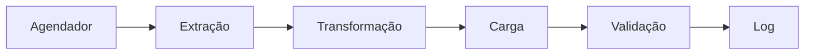

# Arquitetura do Sistema

## Visão Geral

O Sistema de Atualização do Data Warehouse implementa um pipeline ETL robusto para manter dados sincronizados entre sistemas operacionais e um data warehouse. A arquitetura garante integridade dos dados, tolerância a falhas e estrutura de código manutenível.

## Componentes Principais

### 1. Camada de Banco de Dados

#### Banco de Dados de Origem (Operacional)

- Dados operacionais em tempo real
- Otimizado para OLTP
- Tabelas:
  - users (usuários)
  - units (unidades)
  - devices (dispositivos)
  - energy (energia)
  - energy_compensate (compensação de energia)
  - irradiance (irradiância)

#### Banco de Dados de Destino (Data Warehouse)

- Modelo dimensional
- Otimizado para OLAP
- Esquemas:
  - Dimensões
    - dim_users (dimensão usuários)
    - dim_units (dimensão unidades)
    - dim_devices (dimensão dispositivos)
    - dim_day_climate (dimensão clima diário)
  - Fatos
    - fact_energy (fatos de energia)

### 2. Camada de Aplicação

#### Módulo de Configuração

- Gerenciamento de ambiente
- Pools de conexão com banco de dados
- Configurações do agendador
- Parâmetros de segurança

#### Serviço ETL

- Atualizações de tabelas dimensionais
- Processamento de tabelas fato
- Validação de dados
- Regras de transformação

#### Serviços Utilitários

- Sistema de logs
- Tratamento de erros
- Validação de dados
- Monitoramento de desempenho

#### Agendador

- Gerenciamento de tarefas cron
- Orquestração de processos
- Recuperação de erros
- Gerenciamento de recursos

## Fluxo de Dados

### 1. Inicialização

- Carregamento de variáveis de ambiente
- Inicialização dos pools de conexão
- Início dos sistemas de monitoramento

### 2. Processo ETL

### 3. Tratamento de Erros

- Lógica de reconexão
- Gerenciamento de transações
- Registro de erros
- Sistema de alertas

## Segurança

### Segurança do Banco de Dados

- Pools de conexão separados
- Princípios de privilégio mínimo
- Credenciais criptografadas
- Timeouts de conexão

### Segurança da Aplicação

- Isolamento de ambiente
- Validação de entrada
- Mascaramento de erros
- Logs de auditoria

## Desempenho

### Estratégias de Otimização

1. Pool de Conexões

   - Reuso de conexões
   - Gerenciamento do tamanho do pool
   - Tratamento de timeouts

2. Processamento em Lote

   - Tamanhos ótimos de lote
   - Gerenciamento de memória
   - Acompanhamento de progresso

3. Uso de Índices
   - Indexação estratégica
   - Otimização de consultas
   - Monitoramento de desempenho

## Monitoramento

### Coleta de Métricas

- Duração dos processos
- Contagem de registros
- Taxa de erros
- Uso de recursos

### Logs

- Formato estruturado de logs
- Rotação de logs
- Categorização de erros
- Acompanhamento de desempenho

## Manutenção

### Tarefas Regulares

1. Diárias

   - Revisão de logs
   - Verificação de processos
   - Análise de erros

2. Semanais

   - Revisão de desempenho
   - Otimização de recursos
   - Validação de dados

3. Mensais
   - Atualizações do sistema
   - Revisão de segurança
   - Planejamento de capacidade

## Recuperação de Desastres

### Estratégia de Backup

- Backups regulares
- Recuperação pontual
- Verificação de backup

### Procedimentos de Recuperação

1. Falha do Sistema

   - Reinício automático
   - Recuperação de estado
   - Validação de dados

2. Corrupção de Dados
   - Rollback de transação
   - Reprocessamento de dados
   - Verificações de integridade

## Melhorias Futuras

### Melhorias Planejadas

1. Processamento em tempo real
2. Monitoramento avançado
3. Escalonamento automatizado
4. Segurança aprimorada

### Considerações de Escalabilidade

- Escalonamento horizontal
- Balanceamento de carga
- Otimização de recursos
